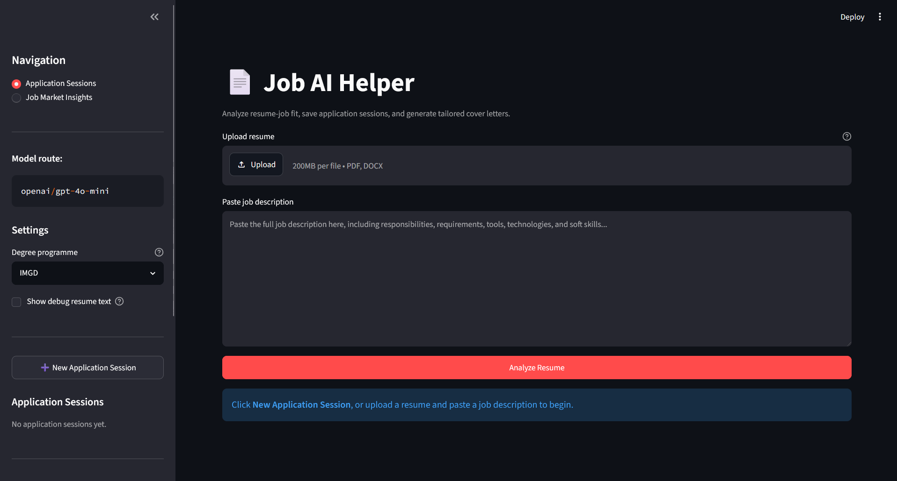

# Job AI Helper


**Job AI Helper** is an AI-powered resume and job application assistant for students and junior applicants. It helps users analyse resume-job fit, generate grounded cover letters, save application sessions, and ask RAG-based job market questions across analysed job descriptions.



---

## Problem

Students and fresh graduates often apply to multiple internships or junior roles, but it can be difficult to judge whether a resume matches each job description.

Common pain points:

- Job descriptions contain many required skills, preferred skills, tools, and soft-skill expectations.
- Important JD keywords can be missed during manual checking.
- Cover letters can become generic and time-consuming to tailor.
- Repeated job-market skill patterns are hard to see across many job descriptions.

AI is suitable because resume-job matching involves reading and comparing unstructured text. The app uses AI to extract skills, requirements, gaps, and evidence from resumes and job descriptions, then generates grounded application support.

---

## Approach

The app is split into two main workflows.

### 1. Application Sessions

This workflow compares **one resume against one job description**.

1. User uploads a PDF or DOCX resume.
2. User pastes a full job description.
3. The app parses the resume text.
4. A multi-step LLM pipeline extracts and analyses:
   - resume profile
   - job description profile
   - keyword match
   - bullet quality
   - resume structure
   - jargon clarity
   - degree alignment
5. The app calculates an overall resume-job fit score.
6. The user can generate and revise a tailored cover letter.
7. The analysis, cover letter, and chat history are saved in SQLite.

### 2. Job Market Insights with RAG

This workflow compares **one resume against many analysed job descriptions**.

1. Every analysed job description is saved into a JD library.
2. The app chunks the JD text and indexes it in ChromaDB.
3. The user can upload or paste a separate resume in the Job Market Insights page.
4. The app calculates a Market Fit Score based on recurring JD skills.
5. The user can ask RAG questions such as:
   - "What skills appear often in the jobs I analysed?"
   - "Based on my resume, what common skills should I strengthen?"

RAG is used because the job-description library grows over time. Instead of sending every saved JD into one prompt, the app retrieves relevant job-description chunks from ChromaDB before asking the LLM to answer.

---

## Tech Stack

| Layer | Technology |
|---|---|
| Language | Python 3.10+ |
| Web interface | Streamlit |
| AI / Model | OpenAI through LiteLLM, default route `openai/gpt-4o-mini` |
| Embeddings | `openai/text-embedding-3-small` |
| Prompting | Structured system prompts and JSON schemas |
| Resume parsing | `pypdf` for PDF, `python-docx` for DOCX |
| Database | SQLite |
| Vector database | ChromaDB |
| RAG data | Analysed job-description chunks |
| Outputs | Streamlit tables, JSON report download, Markdown report download, TXT cover letter download |
| Environment management | `python-dotenv`, `.env`, Streamlit secrets support |

---

## Results

The project produces a demo-ready AI workflow with:

- **5 resume-job sub-scores:** keyword match, bullet quality, structure, jargon, and degree alignment.
- **1 weighted overall score** for one resume against one job description.
- **1 Market Fit Score** comparing a resume against recurring skills across analysed job descriptions.
- **2 saved chat modes:** per-application analysis chat and global Job Market Insights RAG chat.
- **Persistent local storage** for application sessions, generated cover letters, analysed JDs, and chat history.
- **RAG retrieval** over previously analysed job descriptions using ChromaDB.

Example outputs include:

```text
Overall Resume Score: 75/100
Keyword Match: Present and missing JD keywords
Bullet Quality: Feedback on action, technology, and impact
Market Fit Score: Resume coverage against recurring job-market skills
RAG Answer: Common skills across analysed job descriptions
```

The scores are intended as guidance, not as a guaranteed real ATS result.

---

## Setup & Usage

### Prerequisites

- Python 3.10+
- OpenAI API key
- Git
- A text-based PDF or DOCX resume for testing

### Installation

```bash
git clone <your-github-repository-url>
cd <your-repository-folder>
python -m venv .venv
```

Activate the virtual environment.

Windows CMD:

```cmd
.venv\Scripts\activate
```

Windows PowerShell:

```powershell
.venv\Scripts\activate
```

macOS/Linux:

```bash
source .venv/bin/activate
```

Install dependencies:

```bash
pip install -r requirements.txt
```

### Environment Variables

Copy `.env.example` to `.env`.

Windows CMD:

```cmd
copy .env.example .env
```

Windows PowerShell:

```powershell
Copy-Item .env.example .env
```

macOS/Linux:

```bash
cp .env.example .env
```

Example `.env.example`:

```env
MODEL=openai/gpt-4o-mini
OPENAI_API_KEY=your_openai_api_key_here
EMBEDDING_MODEL=openai/text-embedding-3-small
```

Do not commit your real `.env` file.

### Run

```bash
streamlit run app.py
```

### Basic Usage

1. Open the **Application Sessions** page.
2. Click **New Application Session**.
3. Upload a text-based PDF or DOCX resume.
4. Paste a full job description.
5. Click **Analyze Resume**.
6. Review the score, keyword match, bullet quality, structure, jargon, and degree fit.
7. Generate or revise a cover letter.
8. Ask follow-up questions about the saved analysis.
9. Open **Job Market Insights** to ask RAG questions across analysed job descriptions.

---

## Example Usage

### Resume-job analysis

Input:

```text
Resume: Software engineering student resume
Job description: Software Engineer Intern role requiring Python, SQL, REST APIs, cloud knowledge, and teamwork
Degree programme: IMGD
```

Expected output:

```text
Overall score
Keyword match table
Missing keyword table
Bullet quality feedback
ATS structure audit
Degree alignment explanation
```

### Cover letter generation

Input:

```text
Generate a cover letter for this job application.
```

Expected output:

```text
A tailored 3-4 paragraph cover letter based on the resume profile, job description profile, and analysis summary.
```

Follow-up request:

```text
Make it shorter and more confident.
```

Expected output:

```text
A revised cover letter that keeps the facts accurate while changing tone and length.
```

### Job Market Insights RAG

Input:

```text
What skills appear often in the jobs I analysed?
```

Expected output:

```text
A RAG-grounded answer based on retrieved chunks from analysed job descriptions.
```

### Resume market-fit comparison

Input:

```text
Upload or paste a resume in Job Market Insights, then click Analyze Resume for Market Fit.
```

Expected output:

```text
Market Fit Against Frequent JD Skills: 68/100
Common Skills Already Shown
Common Skills Missing or Weakly Evidenced
Common JD terms used for scoring
```

---

## Project Structure

```text
job-ai-helper/
├── app.py                         # Main Streamlit application
├── analyzer.py                    # Multi-step LLM analysis pipeline
├── llm.py                         # LLM wrapper functions
├── parse.py                       # PDF/DOCX resume parsing
├── prompts.py                     # System prompts and JSON schemas
├── report.py                      # Markdown report rendering
├── requirements.txt
├── README.md
├── .env.example
├── assets/
│   └── frontpage.png
├── database/
│   ├── db_manager.py              # Application session storage
│   ├── jd_library_manager.py      # Analysed JD library storage
│   └── chat_history_manager.py    # Persistent chat history storage
├── rag/
│   ├── __init__.py
│   └── jd_chroma_rag.py           # ChromaDB indexing, retrieval, and Market Fit Score
├── data/
│   └── .gitkeep
└── outputs/
    └── .gitkeep
```

---

## Limitations & Future Work

### Limitations

- The app works best with text-based PDF and DOCX resumes. Scanned or image-only resumes may not parse correctly.
- Saved sessions restore the analysis report, generated cover letter, and chat history, but not the original uploaded PDF or DOCX file.
- Scores are estimates and not real ATS guarantees.
- The Market Fit Score uses extracted JD terms, term frequency, field weighting, and resume term matching, so it may miss synonyms or over-match broad phrases.
- RAG quality depends on the number and quality of analysed job descriptions.
- ChromaDB and SQLite are local, so the current setup is suitable for a single-user demo rather than a production multi-user system.
- The app does not automatically apply for jobs or scrape job portals.

### Future Work

- Improve duplicate JD detection.
- Improve market-fit scoring with stronger semantic matching.
- Show which job descriptions support each RAG answer.
- Add DOCX export for generated cover letters.
- Add optional secure resume-file storage per session.
- Add cover letter version history.
- Add user accounts and cloud database storage.
- Add a safe jobs API for job discovery without scraping.
- Add a resume improvement plan that suggests truthful improvements without inventing experience.

---

## Ethical Considerations

- The app should assist user judgment, not replace human review.
- Generated cover letters and resume advice should not invent experience, companies, skills, or achievements.
- Resume data contains personal information, so the app avoids storing original uploaded resume files by default.
- AI scoring can be biased or inconsistent, so scores should be treated as guidance rather than absolute truth.
- Job-market insights depend on the quality and variety of analysed job descriptions.

---

## About the Author

**Darren Lua**


[LinkedIn](https://www.linkedin.com/in/darren-lua/) · [GitHub](https://github.com/darren0139/job-ai-helper)


---

## License
[MIT](LICENSE)

